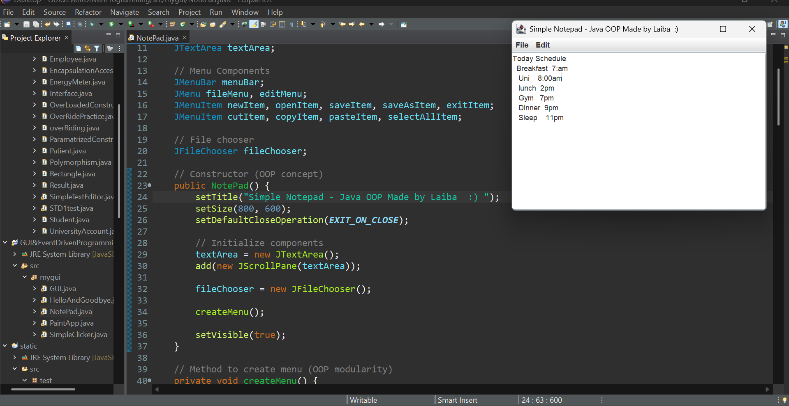

# 📝 Java Notepad Clone

> A fully functional Notepad application built from scratch 
> using Java Swing & OOP principles — inspired by Windows Notepad.
> Made with ❤️ and weak hands 😄

---

## 📸 Screenshots

| App | Preview |
|-----|---------|
| Notepad Clone |  |

---

## ✨ Features

| Feature | Status |
|---------|--------|
| New File | ✅ |
| Open File | ✅ |
| Save File | ✅ |
| Save As | ✅ |
| Cut / Copy / Paste | ✅ |
| Select All | ✅ |
| Scrollable Text Area | ✅ |
| File Chooser Dialog | ✅ |
| Custom Title Bar | ✅ |

---

## 🧠 Concepts Applied

| Concept | How It's Used |
|---------|--------------|
| OOP | Constructor builds entire GUI |
| `JTextArea` | Main text editing area |
| `JScrollPane` | Wraps textArea for scrolling |
| `JMenuBar` | Top menu bar |
| `JMenu` | File & Edit menus |
| `JMenuItem` | Individual menu options |
| `JFileChooser` | Open & Save file dialogs |
| Modularity | `createMenu()` as separate method |
| `ActionListener` | Handles all menu click events |

---

## 🗂️ What's Inside

| File | Description |
|------|-------------|
| `NotePad.java` | Complete Notepad clone with File & Edit menus |

---

## 🚀 How to Run

1. Make sure **JDK 8+** is installed
2. Clone the repo:
```bash
   git clone https://github.com/laibaazeem3250-ship-it/java-notepad-clone.git
```
3. Open in **Eclipse IDE**
4. Run `NotePad.java`
5. Start typing — try File → Save! 🖊️

---

## 💡 App Architecture
NotePad (JFrame)
├── JMenuBar
│     ├── JMenu (File)
│     │     ├── New
│     │     ├── Open
│     │     ├── Save
│     │     ├── Save As
│     │     └── Exit
│     └── JMenu (Edit)
│           ├── Cut
│           ├── Copy
│           ├── Paste
│           └── Select All
└── JScrollPane
└── JTextArea (main editor)

---

## 📅 Progress Log

| Date | What I Built |
|------|-------------|
| April 7, 2026 | Full Notepad clone with File & Edit menus |

---

## 🛠️ Tech Stack


---

## 🙋‍♀️ Author

**Laiba Azeem**  
🎓 CS Student | Building real apps while still learning 💪  
*"Lagayen gy tou seekhey gy"* — My Professor 😄

[](https://github.com/laibaazeem3250-ship-it)
